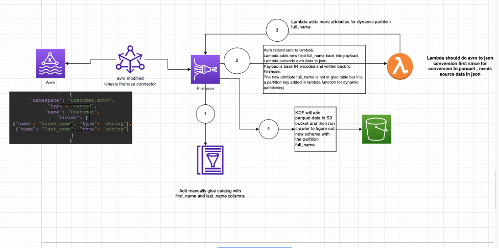
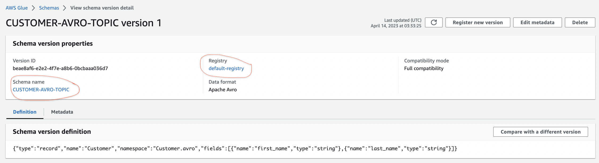
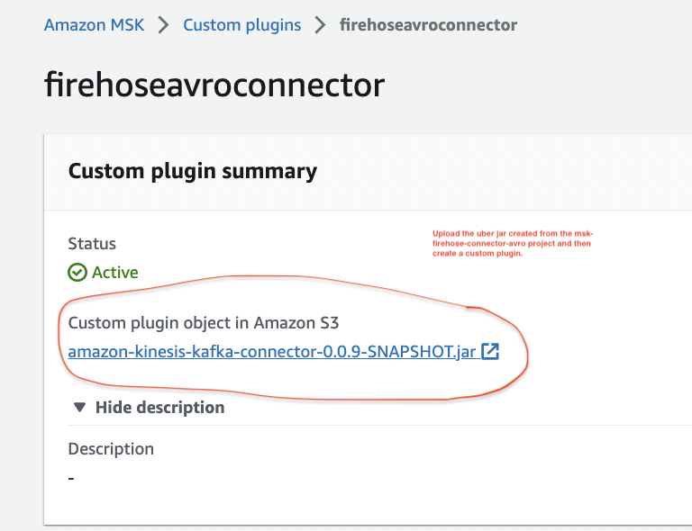
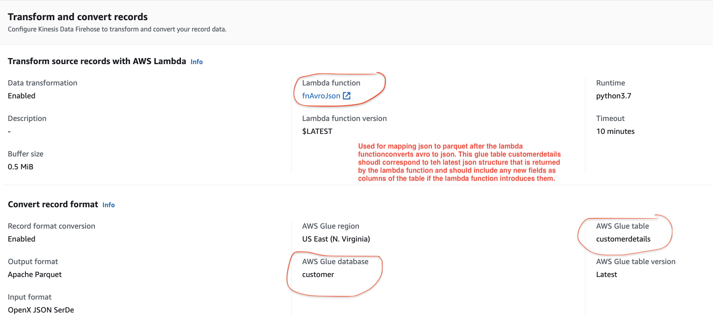
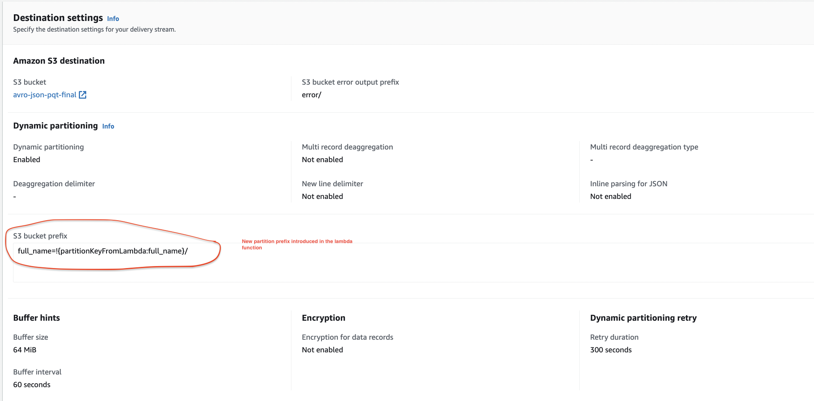
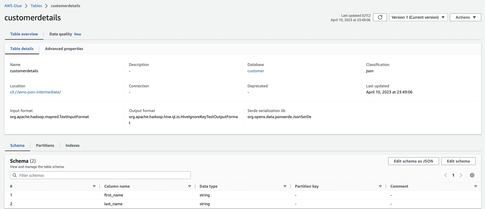

# What is the repo about
This repository shows the code for different parts of an ecosystem to send AVRO format data from a kafka producer to MSK. Ultimately this data needs to be available in the data lake and should be fit for analytics purpose. In our setup the producer (Spring boot project in the msk_producer_consumer_avro folder) will produce AVRO format data to the MSK Cluster. Additionally,

# What is the architecture of the setup

# Steps for setup to follow this repo
    1-Create vpc endpoints for glue and firehose in the same subnets as the msk cluster and msk connector.\
    2-Setup the MSK Cluster.\
    3-Setup the Spring boot Producer.\
    4-Deploy lambda function first.\
    5-Setup the Firehose Delivery stream with the lambda.\
    6-Deploy the custom plugin.\
    7-Deploy the MSK Connector based off the custom plugin

# Brief setup instructions

Setup the MSK Cluster. Make sure to setup the security groups for the MSK Cluster so that it can communicate with the producer and the MSK Connector that will be setup later.

The Producer is a spring boot project in msk_producer_consumer_avro.
I have also added a consumer in the same project, so that I can make sure that my Producer  Application is able to connect and send data to MSK and a Consumer Application is able to receive the data from MSK. To be able to test quickly, I pushed the Docker container for msk_producer_consumer_avro to ECR and ran the container on a Cloud9 environment. My Cloud9 environment is in the same vpc and subnet as MSK. Setup the following properties for the Producer to be able to connect to Glue Schema registry.
 props.put(AWSSchemaRegistryConstants.AVRO_RECORD_TYPE, AvroRecordType.SPECIFIC_RECORD.getName());
 props.put(AWSSchemaRegistryConstants.SCHEMA_AUTO_REGISTRATION_SETTING, "true");
 props.put(AWSSchemaRegistryConstants.COMPATIBILITY_SETTING, Compatibility.FULL);

 For more control over the name of the glue registry and the schema name you can also set these properties
 
 props.put(AWSSchemaRegistryConstants.REGISTRY_NAME, "<some valid registry name>");
 props.put(AWSSchemaRegistryConstants.SCHEMA_NAME, "<some valid schema name>");

When you don't specify the REGISTRY_NAME and SCHEMA_NAME attributes, by default the glue schema registry is named default-registry and the schema name is the name of the MSK TOPIC into which the avro data is being inserted. So the schema name is CUSTOMER-AVRO-TOPIC 

For quick test you could run the docker container for the spring boot producer in Cloud 9 as shown in the diagram below (In actuality you might run the producer as lambda, the spring boot container in ecs/eks).
>>Admin:~/environment $ `docker run -p 8080:8080 XXXXXX.dkr.ecr.us-east-1.amazonaws.com/kafka-producer:latest`

MSK Connector Setup - For the MSK connector setup the code is in the msk-firehose-connector-avro folder. In order to deploy the connector code, create a java jar file . build the java jar file with the command `mvn clean package`. If you open the pom.xml you will see the `maven-shade-plugin` which will bundle all dependencies in the jar and create a fat jar that is needed for the msk connect jar. MSK Connect is serverless option for running yoru Kafka connect code. Run the MSK Connect in the same vpc and subnets as the MSK Cluster. Make sure appropriate security groups are used so that MSK Connect can communicate with MSK Cluster , Firehose vpc endpoint , Glue VPC endpoint. Internally the MSK Connect code will also connect to the glue schema registry

Configuration values for MSK Connector

<code>connector.class=com.amazon.kinesis.kafka.FirehoseSinkConnector 
value.converter.schemaAutoRegistrationEnabled=true 
key.converter.endpoint=https://vpce-xxxx-xxx.glue.us-east-1.vpce.amazonaws.com
tasks.max=1  
key.converter.region=us-east-1  
value.converter.endpoint=https://vpce-xxx-xxx.glue.us-east-1.vpce.amazonaws.com  
key.converter.schemaName=CUSTOMER-AVRO-TOPIC 
value.converter.timeToLiveMillis=3600000 
value.converter.avroRecordType=GENERIC_RECORD 
key.converter.timeToLiveMillis=3600000  
value.converter.schemaName=CUSTOMER-AVRO-TOPIC  
batchSizeInBytes=3670016  
value.converter.compressionType=NONE  
kinesisEndpoint=https://vpce-xxxx-xxxx.firehose.us-east-1.vpce.amazonaws.com  
key.converter.cacheSize=100  
key.converter.avroRecordType=GENERIC_RECORD  
value.converter=com.amazonaws.services.schemaregistry.kafkaconnect.AWSKafkaAvroConverter 
key.converter=com.amazonaws.services.schemaregistry.kafkaconnect.AWSKafkaAvroConverter  
value.converter.cacheSize=100 
topics=CUSTOMER-AVRO-TOPIC  
batch=false  
value.converter.registry.name=default-registry  
deliveryStream=PUT-AVRO-DYNAMIC-PQT  
value.converter.region=us-east-1 
key.converter.registry.name=default-registry 
key.converter.schemaAutoRegistrationEnabled=true 
key.converter.compressionType=NONE 
region=us-east-1 
batchSize=200 
</code>

To deploy the MSK Connector Code create the MSK connect Custom plugin that points to the MSK connect jar uploaded to the s3 bucket. Set up MSK connect from the custom plugin. 

follow this for setting up the correct IAM Role for MSK Connector
https://aws.amazon.com/premiumsupport/knowledge-center/kinesis-kafka-connector-msk/

Firehose Setup -The firehose stream receives data in avro format and calls lambda function which converts data to json , adds a new field full_name into the data field, as well as a full_name field as a partition key and puts it back into the firehose delivery stream. If I don’t want full_name field to be added as a column field (attribute)  in the actual parquet file , there is no need to add it to the glue table which Firehose will use for source mapping. Any fields not in the glue catalog table, will not show up in the final parquet file. This glue catalog table is separate from the glue schema registry used by the connector. The glue catalog table is used when you want to convert json data to ORC/Parquet format and is applied on the incoming source data in Firehose. Incoming source data in this case is data that is coming back to Firehose after being transformed by the lambda firehose-lambda-dynamic-avro-to-json.

Glue table settings for source mapping that will be called inside Firehose after return from lambda

The code for the Lambda function is in firehose-lambda-dynamic-avro-to-json folder. I have created a script.zip of the code and its dependencies. The actual deserialization code for converting the data structure is in lambda_function.py. In addition to converting the data from Avro to Json, the lambda function can also add new columns to the data or add partition keys to the data. This lambda function in my case is used for dynamic partitioning of the data and adds new partitions to the data set, so that I can store it in a folder structure as per my analytics needs.
>>How to test -Select template as firehose and create a sample event with base64 encoded data 
<code>{
  "invocationId": "invocationIdExample", 
  "deliveryStreamArn": "arn:aws:kinesis:EXAMPLE", 
  "region": "us-east-1", 
  "records": [ 
    { 
      "recordId": "49546986683135544286507457936321625675700192471156785154", 
      "approximateArrivalTimestamp": 1495072949453, 
      "data": "'T2JqAQQWYXZyby5zY2hlbWH6AnsidHlwZSI6InJlY29yZCIsIm5hbWUiOiJDdXN0b21lciIsIm5hbWVzcGFjZSI6IkN1c3RvbWVyLmF2cm8iLCJmaWVsZHMiOlt7Im5hbWUiOiJmaXJzdF9uYW1lIiwidHlwZSI6InN0cmluZyJ9LHsibmFtZSI6Imxhc3RfbmFtZSIsInR5cGUiOiJzdHJpbmcifV0sImNvbm5lY3QubmFtZSI6IkN1c3RvbWVyLmF2cm8uQ3VzdG9tZXIifRRhdnJvLmNvZGVjCG51bGwAxgOHt3Rlr1xYX3GToa8rNgIaBkFkYRBMb3ZlbGFjZcYDh7d0Za9cWF9xk6GvKzY='"
    }
  ]
}
</code>

